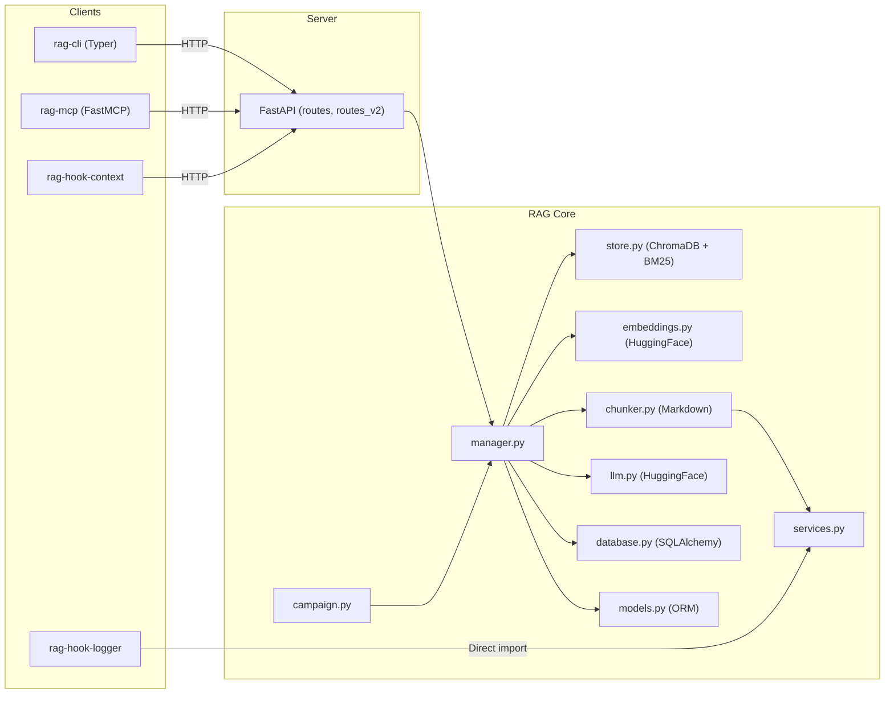

# Code Review: rag-dnd v0.2.0

Volledige analyse van het project op basis van **alle bronbestanden** (~2100 regels over 25+ files).

---

## Architectuur — Overzicht



### Verdict: Solide Basisarchitectuur 👍

De scheiding in **server / client / rag-core / hooks / mcp** is logisch en schaalbaar. De client-server architectuur is een goede keuze — clients zijn thin HTTP-wrappers, server houdt state. Hybrid search met RRF is een kwalitatief hoogwaardige keuze.

---

## Bevindingen

### 🔴 Kritieke Issues

#### 1. Mutable Default Argument — Config wordt bij import ge-evaluated

```python
# manager.py:49, 133, 183, 232
def store_document(filename, custom_filename=None, config: Config=Config.load()):
```

`Config.load()` wordt **eenmalig** aangeroepen bij het laden van de module, niet per functiecall. Dit is een [bekende Python-pitfall](https://docs.python-guide.org/writing/gotchas/#mutable-default-arguments). Als de `.env` of environment variabelen later wijzigen, gebruikt de functie alsnog de oorspronkelijke config.

Hetzelfde geldt voor:

- [embeddings.py:23](file:///c:/Development/src/_AI/rag_dnd/src/rag_dnd/rag/embeddings.py#L23) — `Embedding.__init__`
- [cli/main.py:29](file:///c:/Development/src/_AI/rag_dnd/src/rag_dnd/cli/main.py#L29) — module-level `client = RAGClient(ClientConfig.load())`
- [cli/main.py:214](file:///c:/Development/src/_AI/rag_dnd/src/rag_dnd/cli/main.py#L214) — default `prompt_file=ClientConfig.load().summary_prompt_file`

**Fix**: Gebruik `None` als default en laad in de body:

```python
def store_document(filename, config: Config | None = None):
    if config is None:
        config = Config.load()
```

#### 2. Bare `except:` clauses verbergen bugs

```python
# routes.py:28
except:
    raise HTTPException(status_code=409, detail="Document already exists")
```

Dit vangt **alle** exceptions — inclusief `KeyboardInterrupt`, `SystemExit`, en echte bugs zoals `TypeError`. Drie bare excepts in [routes.py](file:///c:/Development/src/_AI/rag_dnd/src/rag_dnd/server/routes.py#L28-L43).

**Fix**: Vang specifieke exceptions:

```python
except (DatabaseError, FileExistsError) as e:
    raise HTTPException(status_code=409, detail=str(e))
```

#### 3. Bare `except:` in config — swallows alle errors

```python
# config.py:59
except:
    return False
```

[\_is_writable](file:///c:/Development/src/_AI/rag_dnd/src/rag_dnd/config.py#L40-L60) vangt silently alle errors inclusief `PermissionError`, `MemoryError`, etc.

**Fix**: `except (OSError, IOError):` is voldoende.

#### 4. Session Management: Geen Request-Scoped Sessions

> ⚠️ Je hebt dit zelf al geïdentificeerd in [todo.md:142-144](file:///c:/Development/src/_AI/rag_dnd/doc/todo.md#L142-L144)

`get_session()` creëert telkens een _nieuwe_ session. In [manager.py](file:///c:/Development/src/_AI/rag_dnd/src/rag_dnd/rag/manager.py) wordt `init_db()` + `get_session()` lokaal aangeroepen in elke functie. Maar:

- `store_document()` roept `init_db()` aan, maar `query()` niet (regel 161 vs 77).
- Sessions worden inconsistent gesloten: `session.close()` in `store_document` (L130), maar expunge+geen close in `query` (L168).
- `_get_engine()` maakt een **nieuwe** engine per call — dit is extreem duur (connection pool overhead).

---

### 🟠 Significante Issues

#### 5. Engine wordt elke keer opnieuw aangemaakt

```python
# database.py:11-22
def _get_engine():
    config = Config.load()
    return create_engine(url=config.content_database_url)
```

`create_engine` wordt bij **elke** `get_session()` call aangeroepen. SQLAlchemy engines zijn designed als singletons — ze beheren een connection pool intern.

**Fix**: Gebruik een module-level singleton:

```python
_engine = None
def _get_engine():
    global _engine
    if _engine is None:
        _engine = create_engine(...)
    return _engine
```

#### 6. `CampaignMetadata.load_by_*` — Detached Instance Problem

```python
# models.py:110-111
def load_by_id(cls, id: int) -> "CampaignMetadata":
    with get_session() as session:
        return session.query(cls).filter(cls.id == id).first()
```

Het object wordt gereturnd _na_ de session is gesloten (via `with`), waardoor lazy-loaded relaties (zoals `collections`) een `DetachedInstanceError` geven. Bovendien checkt `get_session()` helemaal niet of het als context manager werkt — de `Session` class van SQLAlchemy ondersteunt dit wel, maar alleen met `sessionmaker`.

#### 7. Global Mutable State voor Singletons

```python
# store.py:256 — _vector_store_instance
# embeddings.py:16 — embedding_instance
# llm.py:11 — llm_instances
```

Drie modules gebruiken module-level globals als lazy singletons. Dit is niet thread-safe en maakt testen moeilijk (geen dependency injection).

#### 8. `transcript.py` — Raw sqlite3 vs SQLAlchemy

De `client/transcript.py` module gebruikt **raw `sqlite3`** terwijl de rest van het project SQLAlchemy gebruikt. Dit creëert twee parallelle database-paradigma's.

Dit is bewust (client-side vs server-side), maar het dupliceert schema-management en mist ORM-voordelen (migraties, relaties, type-safety).

#### 9. `store_document_v2` — Race Condition

```python
# client.py:64-67
if response.status_code == 409:
    # File opened AGAIN en PUT request gedaan
    response = requests.put(url, files=file_stream, params=params)
```

Bij een 409 (al bestaand) wordt het bestand _opnieuw_ geopend en een PUT gestuurd. De `file_handle` van de eerste open is al gesloten binnen de `with`. Dit werkt, maar het patroon suggereert dat de client eigenlijk een "upsert" semantiek wil — dit hoort server-side te zitten.

#### 10. Hardcoded Debug Path

```python
# query_hook.py:14
debug_file = r"C:\Development\src\_AI\rag_dnd\hook_debug.log"
```

Absolutte Windows-path hardcoded. Dit werkt alleen op jouw machine.

---

### 🟡 Code Quality Issues

#### 11. Duplicatie van `QueryResult`

Er bestaan **twee** `QueryResult` klassen:

- [rag/models.py:85](file:///c:/Development/src/_AI/rag_dnd/src/rag_dnd/rag/models.py#L84-L88) — `@dataclass`
- [client/client.py:13](file:///c:/Development/src/_AI/rag_dnd/src/rag_dnd/client/client.py#L12-L15) — `@dataclass`

Identieke structuur, maar twee aparte klassen. Het client-side model is acceptabel als "DTO", maar het ontbreken van een gedeeld schema leidt tot stilte als de server-side verandert.

#### 12. Inconsistente Boolean Parsing

```python
# config.py:181 — FOUT
actual_config["api_auto_reload"] = bool(str(os.getenv("...")))
# bool("FALSE") == True! Elke non-empty string is truthy.

# config.py:201 — CORRECT
expansion_enabled = str(os.getenv("...")).upper()
actual_config["query_expansion_enabled"] = expansion_enabled == "TRUE" or expansion_enabled == "1"
```

`api_auto_reload` wordt twee keer geparsed (L181 en L240), met de eerste keer **incorrect** (`bool(str(...))` geeft altijd `True` voor non-empty strings).

#### 13. Import Shadowing in `chunker.py`

```python
# chunker.py:10-12
from langchain_core.documents.base import Document  # LangChain Document
from .models import Document, Chunk, Sentence        # OWN Document
```

De LangChain `Document` wordt overschreven door de eigen `Document`. Dit werkt toevallig omdat de LangChain `Document` daarna niet meer nodig is, maar het is verwarrend.

#### 14. File Handle Niet Correct Gesloten

```python
# manager.py:74
file_hash = sha256(open(filename).read().encode()).hexdigest()
```

`open()` zonder `with` statement — de file handle wordt niet gegarandeerd gesloten. Hetzelfde patroon in [manager.py:252](file:///c:/Development/src/_AI/rag_dnd/src/rag_dnd/rag/manager.py#L252) en [manager.py:319](file:///c:/Development/src/_AI/rag_dnd/src/rag_dnd/rag/manager.py#L319).

#### 15. `session_export` — Logica Fout

```python
# cli/main.py:209-210
if not output_file:        # Als GEEN output file...
    dest_file.close()      # ...close stdout?!
```

De logica is omgekeerd: stdout moet niet gesloten worden, maar het geopende bestand wel.

#### 16. `limit` Parameter Wordt Genegeerd

```python
# schemas.py:11
class QueryRequest(BaseModel):
    query: str
    limit: int = 5  # Defined...
```

Maar in [routes.py:47](file:///c:/Development/src/_AI/rag_dnd/src/rag_dnd/server/routes.py#L47):

```python
results = rag.query(request.query)  # ...maar nooit doorgegeven
```

De `limit` parameter van de client wordt compleet genegeerd.

---

### 🟢 Positieve Punten

| Aspect                          | Beoordeling                                                   |
| ------------------------------- | ------------------------------------------------------------- |
| **Docstrings**                  | Consequent aanwezig op alle publieke functies ✅              |
| **Type Hints**                  | Consistent gebruik van moderne Python type syntax ✅          |
| **Logging**                     | Uitgebreid en gestructureerd (debug/info/error) ✅            |
| **Hybrid Search (RRF)**         | Industriestandaard approach, goed geïmplementeerd ✅          |
| **Parent-Child Retrieval**      | Slim ontwerp met sliding window embedding ✅                  |
| **Projectstructuur**            | Logische modulaire opzet met `src/` layout ✅                 |
| **Entry Points**                | Professioneel via `pyproject.toml` met `[project.scripts]` ✅ |
| **Upload Context Manager**      | `temporary_upload()` is elegant met cleanup ✅                |
| **Hash-based Update Detection** | Voorkomt onnodige re-indexing ✅                              |
| **BM25 + Semantic Fusion**      | State-of-the-art retrieval approach ✅                        |

---

## Samenvatting — Prioriteiten

| Prio | Issue                                      | Impact                                    |
| ---- | ------------------------------------------ | ----------------------------------------- |
| 🔴 1 | Mutable default args (`Config.load()`)     | Stale config bij runtime changes          |
| 🔴 2 | Bare `except:` in routes                   | Bugs worden silently verborgen            |
| 🔴 3 | Engine per call + inconsistente sessions   | Performance + data integrity              |
| 🟠 4 | Boolean parsing fout (`api_auto_reload`)   | Config altijd `True`                      |
| 🟠 5 | `session_export` logica-inversie           | stdout wordt gesloten                     |
| 🟠 6 | `limit` parameter genegeerd                | Client verwachting wordt niet gehonoreerd |
| 🟡 7 | Duplicate `QueryResult` + import shadowing | Onderhoudslast                            |
| 🟡 8 | Hardcoded debug pad                        | Niet overdraagbaar                        |

## Eindoordeel

> **Verdict: Goed voor een persoonlijk/hobby-project in actieve ontwikkeling (7/10).**

De kernlogica (hybrid search, parent-child retrieval, sliding-window embeddings) is **kwalitatief hoogwaardig** en toont diep begrip van RAG-architectuur. De projectstructuur is professioneel.

De grootste technische schuld zit in het **session/engine lifecycle management** en **error handling**. De `Campaign` refactor die gaande is zal veel verbeteren, maar de database lifecycle moet mee worden opgelost.

Voor een demo-/studentenproject zou ik de 🔴-items fixen (< 1 uur werk) en de 🟠-items plannen voor v0.3.
