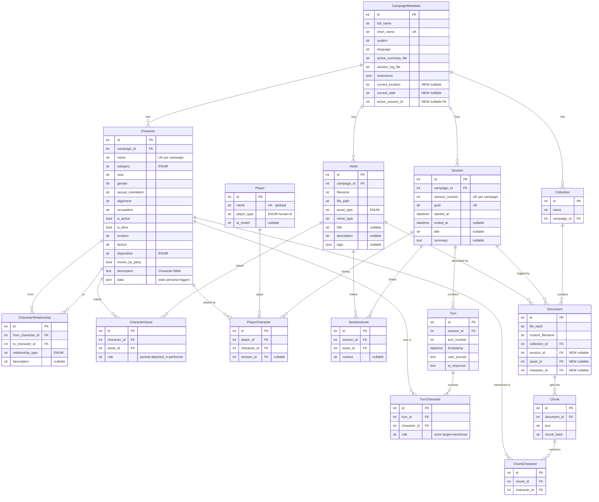

# Data Model: v0.4 Structured D&D Data (Definitief)

## ER Diagram



---

## Enums

```python
class CharacterCategory(str, enum.Enum):
    PC = "PC"
    PARTY_MEMBER = "PARTY_MEMBER"
    NPC = "NPC"
    PASSERBY = "PASSERBY"
    MONSTER = "MONSTER"

class Disposition(str, enum.Enum):
    FRIENDLY = "friendly"
    NEUTRAL = "neutral"
    HOSTILE = "hostile"
    UNKNOWN = "unknown"

class RelationshipType(str, enum.Enum):
    ALLY = "ally"
    RIVAL = "rival"
    FAMILY = "family"
    EMPLOYER = "employer"
    ROMANTIC = "romantic"
    ENEMY = "enemy"
    NEUTRAL = "neutral"

class AssetType(str, enum.Enum):
    IMAGE = "image"
    AUDIO = "audio"
    MAP = "map"
    DOCUMENT = "document"

class PlayerType(str, enum.Enum):
    HUMAN = "human"
    AI = "ai"
```

---

## Modellen (11 nieuw + 3 gewijzigd)

### `Player` — globaal, niet campaign-scoped
| Kolom | Type | Constraint |
|---|---|---|
| `id` | Integer | PK |
| `name` | String | UK |
| `player_type` | Enum | PlayerType |
| `ai_model` | String | nullable — bv. "gemini-2.5-pro" |

> [!IMPORTANT]
> Player is **globaal** — dezelfde speler kan in meerdere campaigns spelen. De koppeling met campaigns loopt via `PlayerCharacter`.

### `Character`
| Kolom | Type | Constraint |
|---|---|---|
| `id` | Integer | PK |
| `campaign_id` | Integer | FK → campaign_metadata.id |
| `name` | String | UK per campaign |
| `category` | Enum | CharacterCategory |
| `race` | String | |
| `gender` | String | |
| `sexual_orientation` | String | |
| `alignment` | String | nullable |
| `occupation` | String | nullable |
| `is_active` | Boolean | default True |
| `is_alive` | Boolean | default True |
| `location` | String | nullable |
| `faction` | String | nullable |
| `disposition` | Enum | Disposition |
| `known_by_party` | Boolean | default False |
| `description` | Text | nullable |
| `data` | JSON | nullable |

### `PlayerCharacter`
| Kolom | Type | Constraint |
|---|---|---|
| `id` | Integer | PK |
| `player_id` | Integer | FK → players.id |
| `character_id` | Integer | FK → characters.id |
| `session_id` | Integer | FK → sessions.id, nullable (null = standaard) |

### `CharacterRelationship` — directioneel (A→B ≠ B→A)
| Kolom | Type | Constraint |
|---|---|---|
| `id` | Integer | PK |
| `from_character_id` | Integer | FK → characters.id |
| `to_character_id` | Integer | FK → characters.id |
| `relationship_type` | Enum | RelationshipType |
| `description` | String | nullable |

### `Asset`
| Kolom | Type | Constraint |
|---|---|---|
| `id` | Integer | PK |
| `campaign_id` | Integer | FK → campaign_metadata.id |
| `filename` | String | |
| `file_path` | String | relatief pad |
| `asset_type` | Enum | AssetType |
| `mime_type` | String | |
| `title` | String | nullable |
| `description` | String | nullable |
| `tags` | JSON | nullable |

### `CharacterAsset` (M:N)
| Kolom | Type | Constraint |
|---|---|---|
| `id` | Integer | PK |
| `character_id` | Integer | FK → characters.id |
| `asset_id` | Integer | FK → assets.id |
| `role` | String | "portrait", "depicted_in", "performer" |

### `Session`
| Kolom | Type | Constraint |
|---|---|---|
| `id` | Integer | PK |
| `campaign_id` | Integer | FK → campaign_metadata.id |
| `session_number` | Integer | UK per campaign |
| `guid` | String | UK |
| `started_at` | DateTime | |
| `ended_at` | DateTime | nullable |
| `title` | String | nullable |
| `summary` | Text | nullable |

### `Turn`
| Kolom | Type | Constraint |
|---|---|---|
| `id` | Integer | PK |
| `session_id` | Integer | FK → sessions.id |
| `turn_number` | Integer | |
| `timestamp` | DateTime | |
| `user_prompt` | Text | |
| `ai_response` | Text | |

### `TurnCharacter` (M:N)
| Kolom | Type | Constraint |
|---|---|---|
| `id` | Integer | PK |
| `turn_id` | Integer | FK → turns.id |
| `character_id` | Integer | FK → characters.id |
| `role` | String | "actor", "target", "mentioned" |

### `SessionAsset` (M:N)
| Kolom | Type | Constraint |
|---|---|---|
| `id` | Integer | PK |
| `session_id` | Integer | FK → sessions.id |
| `asset_id` | Integer | FK → assets.id |
| `context` | String | nullable |

### `ChunkCharacter` (M:N, entity-linking)
| Kolom | Type | Constraint |
|---|---|---|
| `id` | Integer | PK |
| `chunk_id` | Integer | FK → chunks.id |
| `character_id` | Integer | FK → characters.id |

### Wijzigingen: `CampaignMetadata` +3 kolommen
| Kolom | Type |
|---|---|
| `current_location` | String, nullable |
| `current_date` | String, nullable |
| `active_session_id` | Integer, nullable FK → sessions.id |

### Wijzigingen: `Document` +3 FK's
| Kolom | Type | Betekenis |
|---|---|---|
| `session_id` | Integer, nullable FK | "log van sessie X" |
| `asset_id` | Integer, nullable FK | "beschrijft asset X" |
| `character_id` | Integer, nullable FK | "character bible van X" |

---

## Character `data` JSON structuur

```yaml
abilities: { str: 10, dex: 14, con: 12, int: 13, wis: 8, cha: 18 }
combat: { hp_max: 32, hp_current: 24, hp_temp: 0, ac_base: 14, speed: 30 }
modifiers:
  - { type: "bonus", target: "ac", value: 2, source: "Shield", active: true }
resources:
  bardic_inspiration: 3
  spell_slots: { "1": { max: 4, used: 1 } }
conditions: ["Frightened"]
persona:
  traits: "Maakt ongepaste grappen"
  ideals: "Vrijheid boven alles"
  bonds: "Zoekt verlossing"
  flaws: "Kan niet met verantwoordelijkheid omgaan"
  background_story: "Jams was ooit..."
ai_triggers:
  - condition: "hp_current < 25%"
    instruction: "Je bent paniekerig"
```

## Filesystem Layout

```
~/.rag_dnd/campaigns/{slug}/assets/
    images/    portraits, scenes, items
    audio/     songs, ambient
    maps/      battle maps, world maps
    documents/ PDFs, rulebook excerpts
```

---

## Implementatie-aanpak

> [!TIP]
> **Stap 1:** Bouw alle modellen + enums + relationships in `models.py` → `create_all()` maakt het volledige schema.
> **Stap 2+:** Ontsluiting (schemas, routes, CLI) iteratief per domein toevoegen.
