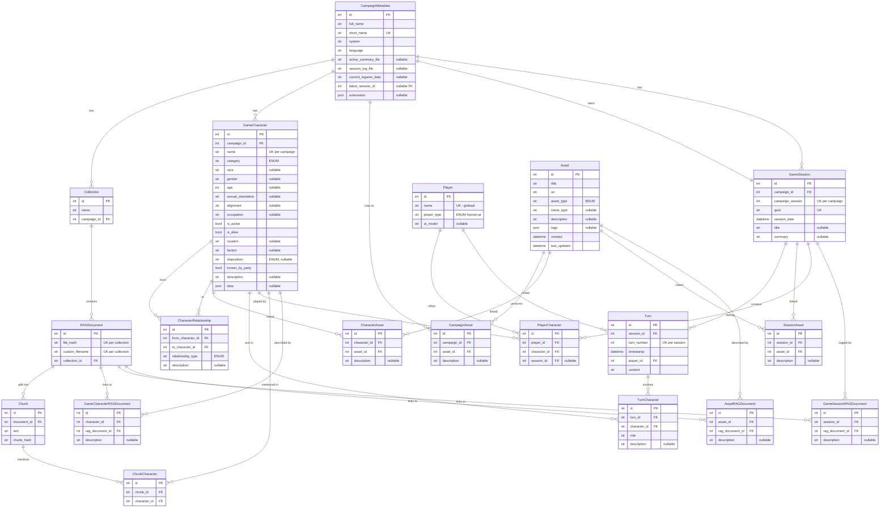

# Data Model: v0.4 Structured D&D Data (Geïmplementeerd)

## ER Diagram



---

## Enums

```python
class CharacterType(str, Enum):
    PC = "pc"
    PARTY_MEMBER = "party_member"
    NPC = "npc"
    PASSERBY = "passerby"
    MONSTER = "monster"


class Disposition(str, Enum):
    FRIENDLY = "friendly"
    NEUTRAL = "neutral"
    HOSTILE = "hostile"
    UNKNOWN = "unknown"


class RelationshipType(str, Enum):
    ALLY = "ally"
    RIVAL = "rival"
    ACQUAINTANCE = "acquaintance"
    FRIEND = "friend"
    FAMILY = "family"
    PARENT = "parent"
    CHILD = "child"
    SIBLING = "sibling"
    SPOUSE = "spouse"
    EX_SPOUSE = "ex_spouse"
    LOVER = "lover"
    EX_LOVER = "ex_lover"
    COLLEAGUE = "colleague"
    EMPLOYER = "employer"
    EMPLOYEE = "employee"
    BUSINESS_PARTNER = "business_partner"
    FRIEND_WITH_BENEFITS = "friend_with_benefits"
    ENEMY = "enemy"
    MENTOR = "mentor"
    APPRENTICE = "apprentice"
    DEITY = "deity"
    WORSHIPPER = "worshipper"
    SERVANT = "servant"
    PATRON = "patron"
    WARLOCK = "warlock"
    CAPTOR = "captor"
    PRISONER = "prisoner"
    SLAVE = "slave"
    MASTER = "master"
    NEUTRAL = "neutral"
    GUARDIAN = "guardian"
    WARD = "ward"
    CREATOR = "creator"
    CREATION = "creation"
    PET = "pet"
    VICTIM = "victim"
    PERPETRATOR = "perpetrator"
    SAVIOR = "savior"
    RESCUEE = "rescuee"
    HANDLER = "handler"
    INFORMANT = "informant"
    DEBTOR = "debtor"
    CREDITOR = "creditor"
    IDOL = "idol"
    FAN = "fan"


class AssetType(str, Enum):
    IMAGE = "image"
    VIDEO = "video"
    AUDIO = "audio"
    TEXT = "text"
    MAP = "map"
    DOCUMENT = "document"
    GRAPH = "graph"
    TABLE = "table"
    OTHER = "other"


class PlayerType(str, Enum):
    HUMAN = "human"
    AI = "ai"
```

---

## Modellen

### `Player` — globaal, niet campaign-scoped

| Kolom         | Type    | Constraint                      |
| ------------- | ------- | ------------------------------- |
| `id`          | Integer | PK                              |
| `name`        | String  | UK                              |
| `player_type` | Enum    | PlayerType                      |
| `ai_model`    | String  | nullable — bv. "gemini-2.5-pro" |

> [!IMPORTANT]
> Player is **globaal** — dezelfde speler kan in meerdere campaigns spelen. De koppeling met campaigns loopt via `PlayerCharacter` en `Turn`.

### `CampaignMetadata`

Heeft naast de bestaande RAG velden de volgende nieuwe state velden voor de campagne status.

| Kolom                 | Type                               |
| --------------------- | ---------------------------------- |
| `current_ingame_date` | String, nullable                   |
| `latest_session_id`   | Integer, nullable FK → game_sessions.id |

### `GameCharacter`

| Kolom                | Type    | Constraint                |
| -------------------- | ------- | ------------------------- |
| `id`                 | Integer | PK                        |
| `campaign_id`        | Integer | FK → campaign_metadata.id |
| `name`               | String  | UK per campaign           |
| `category`           | Enum    | CharacterType             |
| `race`               | String  | nullable                  |
| `gender`             | String  | nullable                  |
| `age`                | Integer | nullable                  |
| `sexual_orientation` | String  | nullable                  |
| `alignment`          | String  | nullable                  |
| `occupation`         | String  | nullable                  |
| `is_active`          | Boolean | default True              |
| `is_alive`           | Boolean | default True              |
| `location`           | String  | nullable                  |
| `faction`            | String  | nullable                  |
| `disposition`        | Enum    | Disposition, nullable     |
| `known_by_party`     | Boolean | default False             |
| `description`        | String  | nullable                  |
| `data`               | JSON    | nullable                  |

### `PlayerCharacter`

| Kolom          | Type    | Constraint                                    |
| -------------- | ------- | --------------------------------------------- |
| `id`           | Integer | PK                                            |
| `player_id`    | Integer | FK → players.id                               |
| `character_id` | Integer | FK → game_characters.id                        |
| `session_id`   | Integer | FK → game_sessions.id, nullable (null = standaard) |

### `CharacterRelationship` — directioneel (A→B ≠ B→A)

| Kolom               | Type    | Constraint         |
| ------------------- | ------- | ------------------ |
| `id`                | Integer | PK                 |
| `from_character_id` | Integer | FK → game_characters.id |
| `to_character_id`   | Integer | FK → game_characters.id |
| `relationship_type` | Enum    | RelationshipType   |
| `description`       | String  | nullable           |

### `Asset` — Global Asset Library

| Kolom          | Type     | Constraint                |
| -------------- | -------- | ------------------------- |
| `id`           | Integer  | PK                        |
| `title`        | String   |                           |
| `uri`          | String   | relatief pad of URL       |
| `asset_type`   | Enum     | AssetType                 |
| `mime_type`    | String   | nullable                  |
| `description`  | String   | nullable                  |
| `tags`         | JSON     | nullable                  |
| `created`      | DateTime | automatic                 |
| `last_updated` | DateTime | automatic                 |

> [!TIP]
> Assets zijn onafhankelijk van campagnes om hergebruik via `CampaignAsset` mogelijk te maken (bijv. globale maps/monsters).

### Koppeltabellen voor Assets (M:N)

| Tabel | Omschrijving | FKs |
| :--- | :--- | :--- |
| `CampaignAsset` | Koppelt Asset aan een/meerdere campagnes. | `campaign_id`, `asset_id` |
| `CharacterAsset` | Bijv. een portret voor een specifiek personage. | `character_id`, `asset_id` |
| `SessionAsset` | Asset die tijdens een sessie ter sprake kwam. | `session_id`, `asset_id` |

*(Elke tabel bevat daarnaast nog een Optionele `description: str` kolom)*

### `GameSession`

| Kolom            | Type     | Constraint                |
| ---------------- | -------- | ------------------------- |
| `id`             | Integer  | PK                        |
| `campaign_id`    | Integer  | FK → campaign_metadata.id |
| `campaign_session`| Integer | UK per campaign           |
| `guid`           | String   | UK                        |
| `session_date`   | DateTime | automatic                 |
| `title`          | String   | nullable                  |
| `summary`        | String   | nullable                  |

### `Turn`

| Kolom         | Type     | Constraint       |
| ------------- | -------- | ---------------- |
| `id`          | Integer  | PK               |
| `session_id`  | Integer  | FK → game_sessions.id |
| `turn_number` | Integer  | UK per session   |
| `timestamp`   | DateTime | automatic        |
| `player_id`   | Integer  | FK → players.id |
| `content`     | String   | Een log-bericht/actie  |

### `TurnCharacter` (M:N)

| Kolom          | Type    | Constraint                     |
| -------------- | ------- | ------------------------------ |
| `id`           | Integer | PK                             |
| `turn_id`      | Integer | FK → turns.id                  |
| `character_id` | Integer | FK → game_characters.id             |
| `role`         | String  | "actor", "target", "mentioned" |
| `description`  | String  | nullable |

### `RAGDocument` Genormaliseerde Relaties (M:N)

| Tabel | Omschrijving | FKs |
| :--- | :--- | :--- |
| `GameCharacterRAGDocument` | Linkt RAG data aan characters. | `character_id`, `rag_document_id` |
| `GameSessionRAGDocument` | Linkt RAG data (logs) aan sessies. | `session_id`, `rag_document_id` |
| `AssetRAGDocument` | Linkt RAG data (descriptions) aan assets. | `asset_id`, `rag_document_id` |

*(Elke tabel bevat daarnaast nog een optionele `description: str` kolom)*

### `ChunkCharacter` (M:N, entity-linking)

| Kolom          | Type    | Constraint         |
| -------------- | ------- | ------------------ |
| `id`           | Integer | PK                 |
| `chunk_id`     | Integer | FK → chunks.id     |
| `character_id` | Integer | FK → game_characters.id |

---

## Character `data` JSON structuur

```yaml
abilities: { str: 10, dex: 14, con: 12, int: 13, wis: 8, cha: 18 }
combat: { hp_max: 32, hp_current: 24, hp_temp: 0, ac_base: 14, speed: 30 }
modifiers:
  - { type: "bonus", target: "ac", value: 2, source: "Shield", active: true }
resources:
  bardic_inspiration: 3
  spell_slots: { "1": { max: 4, used: 1 } }
conditions: ["Frightened"]
persona:
  traits: "Maakt ongepaste grappen"
  ideals: "Vrijheid boven alles"
  bonds: "Zoekt verlossing"
  flaws: "Kan niet met verantwoordelijkheid omgaan"
  background_story: "Jams was ooit..."
ai_triggers:
  - condition: "hp_current < 25%"
    instruction: "Je bent paniekerig"
```

## Filesystem Layout

```
~/.rag_dnd/campaigns/{slug}/assets/
    images/    portraits, scenes, items
    audio/     songs, ambient
    maps/      battle maps, world maps
    documents/ PDFs, rulebook excerpts
```

---

## Implementatie-aanpak (Afgerond in Phase 2)

> [!TIP]
> **Stap 1:** Modellen geïmplementeerd en genormaliseerd (3NF).
> **Stap 2:** SQLite `create_all` geverifieerd via RAG API calls (geen ambiguïteit).
> **Stap 3:** Volgende fase is Data Migratie en API Development.
